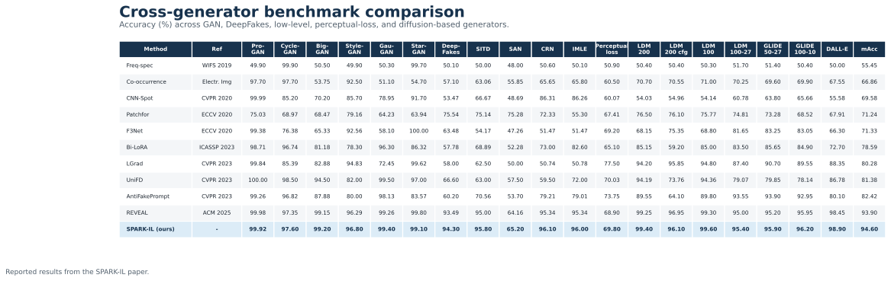
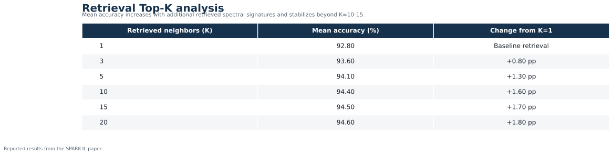
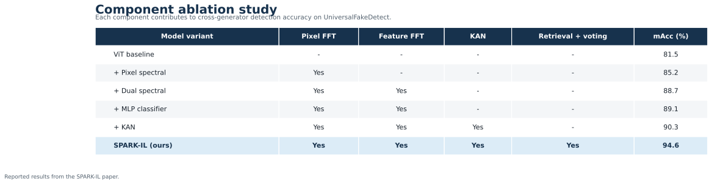
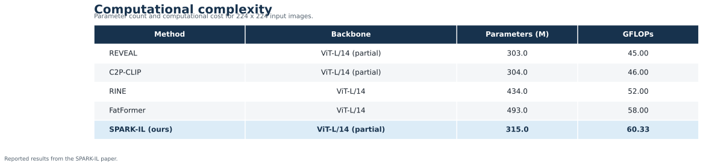

# SPARK-IL

Official implementation of **SPARK-IL: Spectral Retrieval-Augmented RAG for Knowledge-driven Deepfake Detection via Incremental Learning**.

SPARK-IL combines dual-path spectral feature extraction, incremental learning, and retrieval-augmented inference for AI-generated image detection. A partially frozen OpenCLIP ViT-L/14 processes semantic features in parallel with an RGB projection path. Both representations pass through multi-band FFT and KAN-based processing before cross-attention fusion. The resulting spectral embeddings are stored in Milvus and used for nearest-neighbor retrieval and majority-vote classification.

## Results

SPARK-IL achieves **94.60% mean accuracy** across the 19 generators in UniversalFakeDetect, improving over REVEAL by **0.70 percentage points**. The figures below reproduce the results reported in the paper; they are not automatically regenerated when installing this repository.

### Cross-generator benchmark



### Retrieval Top-K analysis

Increasing the number of retrieved spectral signatures improves mean accuracy from **92.80% at K=1** to **94.60% at K=20**, with performance largely stabilizing beyond 10-15 neighbors.



### Component ablation

The dual spectral representation and retrieval-augmented majority voting provide the largest improvements over the ViT baseline.



### Computational complexity

SPARK-IL uses **315M parameters** and requires **60.33 GFLOPs** for a 224 x 224 input.



## Repository contents

| File | Purpose |
|---|---|
| `scripts/train_encoder.py` | Incremental training of the DualSpectralViT-KAN encoder. |
| `scripts/build_embedding_database.py` | Extraction and storage of fused spectral embeddings in Milvus Lite. |
| `scripts/evaluate_ffpp.py` | Retrieval and majority-voting evaluation on FaceForensics++. |

## Pipeline

1. Train the encoder incrementally across generation techniques.
2. Load the trained checkpoint and extract fused spectral embeddings.
3. Store embeddings, binary labels, generator names, filenames, and source paths in Milvus Lite.
4. Encode evaluation images and retrieve their nearest spectral signatures with cosine similarity.
5. Predict real or fake using majority voting over the retrieved labels.

## Use SPARK-IL as an encoder

Install the package from the repository root:

```bash
pip install -e .
```

Place your matching `model1.pth` and `config1.json` in `checkpoints/`. Weights are not included in this repository. The loader accepts a local checkpoint path or directory; it does not download SPARK-IL weights automatically.

```python
from spark_il import SparkILEncoder

encoder = SparkILEncoder.from_pretrained("checkpoints/model1.pth")
embeddings = encoder.encode(["image1.jpg", "image2.jpg"])
print(embeddings.shape)  # torch.Size([2, 768])
```

The encoder applies RGB conversion, 224 x 224 resizing, and the original ImageNet normalization. It returns raw, unnormalized fused embeddings as float32 CPU tensors in input order. Single images, image paths, and lists of PIL images are supported. CUDA is selected automatically when available; pass `device="cpu"` to use CPU.

The package retains the original architecture and checkpoint key names, including the full OpenCLIP model and classification layers. It loads every checkpoint key strictly and initializes OpenCLIP without downloading base weights because the full state dictionary supplies them. Milvus is not required for embedding extraction. The original research scripts remain unchanged.

Verify your local checkpoint and save an embedding:

```bash
python examples/encode_image.py --checkpoint checkpoints/model1.pth --images /path/to/image.jpg --output embeddings.pt
```

Expected output shape for one image is `(1, 768)`. A successful run verifies strict checkpoint loading and finite embeddings, not benchmark accuracy. The large pretrained checkpoint has not been available for end-to-end validation here. Package dependencies are unpinned and are not a reproduction of the original training environment.

## Installation

Python 3.9 or later is recommended.

```bash
git clone https://github.com/HessenUPHF/SPARK-IL.git
cd SPARK-IL
python -m venv .venv
source .venv/bin/activate
pip install -r requirements.txt
```

The OpenCLIP `ViT-L-14` weights are downloaded automatically when the model is initialized.

## Dataset layout

The training code expects one directory per generation technique. Each technique directory must contain `Real` and `Fake` class directories:

```text
data_root/
├── Technique_1/
│   ├── Real/
│   └── Fake/
└── Technique_2/
    ├── Real/
    └── Fake/
```

The FaceForensics++ evaluation script expects:

```text
face++/
├── Real/
└── Fake/
    ├── DeepFake/
    ├── Face2Face/
    ├── FaceShifter/
    ├── FaceSwap/
    └── NeuralTextures/
```

## Training

Run incremental training by providing the dataset root, an ordered comma-separated technique list, and an output directory:

```bash
python scripts/train_encoder.py \
  --data_root /path/to/training/data \
  --techniques DiT,StyleGAN2,VQGAN,StyleGANXL,StyleGAN3,RDDM,SiT,pixart,sd2.1 \
  --out fixed_incremental_model1 \
  --epochs 10 \
  --bs 64 \
  --lr 1e-4
```

The output directory contains:

- `model1.pth`: trained model state dictionary.
- `config1.json`: model and training configuration.
- `incremental_training_report1.csv`: validation statistics by technique.

## Building the retrieval database

Before running `build_embedding_database.py`, update these constants near the beginning of the file for your environment:

- `MODEL_PATH`
- `DATA_ROOT`
- `TECHNIQUES`
- the path passed to `sys.path.append(...)`
- the Milvus Lite database URI

Then run:

```bash
python scripts/build_embedding_database.py
```

The script creates the `deepfake_embeddings` collection with 768-dimensional fused embeddings and a cosine-similarity index.

## FaceForensics++ evaluation

Before running `evaluate_ffpp.py`, update:

- `MODEL_PATH`
- `FFPP_DATA_ROOT`
- the path passed to `sys.path.append(...)`
- the Milvus Lite database URI
- `TOP_K_VALUES` and `SAMPLE_SIZE`, if required

Run the evaluation with:

```bash
python scripts/evaluate_ffpp.py
```

The script reports real, fake, and overall accuracy for every manipulation technique and exports detailed and summarized CSV files.

## Model outputs

The model forward method supports the following outputs:

```python
logits, embeddings, raw_projection = model(images)
fused_embedding = model(images, return_fft=True)
fused, rgb_spectral, vit_spectral = model(
    images,
    return_cross_attention_features=True,
)
```

The fused 768-dimensional representation is the embedding stored and queried by the retrieval pipeline.

## Reproducibility notes

- Images are resized to `224 x 224` and normalized with ImageNet statistics.
- The backbone is OpenCLIP ViT-L/14 pretrained on OpenAI weights.
- Only transformer blocks 22 and 23 of the ViT backbone are trainable.
- The spectral representation uses four frequency bands by default.
- Milvus retrieval uses cosine similarity.
- The training script uses replay, embedding/logit distillation, and parameter regularization for incremental adaptation.
- The paper reports retrieval experiments from 1 to 20 neighbors; the provided FaceForensics++ evaluation script evaluates 5, 10, and 15 neighbors by default.

## Citation

If you use SPARK-IL in your research, please cite:

```bibtex
@article{eutamene2026sparkil,
  title   = {SPARK-IL: Spectral Retrieval-Augmented RAG for Knowledge-driven Deepfake Detection via Incremental Learning},
  author  = {Eutamene, Hessen Bougueffa and Sellam, Abdellah Zakaria and Taleb-Ahmed, Abdelmalik and Hadid, Abdenour},
  journal = {arXiv preprint arXiv:2604.03833},
  year    = {2026}
}
```

Paper: [arXiv:2604.03833](https://arxiv.org/abs/2604.03833)

## Acknowledgments

This work was partially supported by project PCI2022-134990-2 (MARTINI) of the CHIST-ERA IV Cofund 2021 program. Abdenour Hadid was funded by a TotalEnergies collaboration agreement with Sorbonne University Abu Dhabi.
